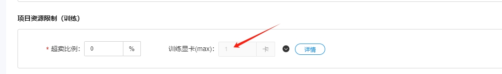
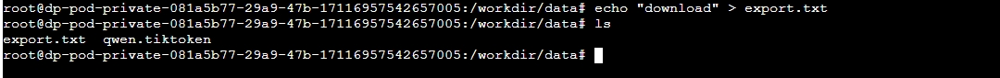

# 操作指南总览

本文将介绍云智算学习平台使用过程中的常用场景及相关操作，供您参考。

## 登录云智算 (算力平台)

*前提：已注册完云智算平台账户，并完成实名认证，在产品超市开通 `训练型` 资源*

在左侧栏点击 `算力平台` 即可跳转至算力控制后台，当弹出警告窗口选择暂时跳过。


## 项目管理

能力部署前需先在用户所在机构下创建项目，如已经完成项目创建，可跳过此步骤。

1. 创建项目: 进入`运营管理` - `项目管理` 模块，单击 `新建项目` 创建项目。


2. 项目配置：编辑项目名称、项目类型，业务类型及资源信息 *(可先默认为0)* 并选择项目经理。填写完成后点击“确定”完成项目创建。


## 资源分配

1. 点击左侧 `资源配置` ,分配训练显卡资源。


2. 点击下方保存按钮，等待 `训练显卡(max)` 值更新为对应卡数。


3. 分配资源到项目: 点击 `项目管理` 中对应项目的 `编辑按钮`, 修改 `训练显卡最大值`。


## 交互式建模

交互式建模可使用系统镜像或自定义上传镜像来创建训练pod以微调大模型参数。*建议使用系统镜像操作*

1. 点击上方菜单栏中 `学习平台`，可以看到资源使用情况。


2. 点击左侧操作栏进入 `交互式建模` 界面。


3. 点击 `新建任务`，准备微调模型。

- 任务名称：自定义，任务类型：通用任务。
- 项目名称：选择上面创建的项目。
- 镜像环境：选择系统镜像，选择pytorch2.0.1镜像即可。
- 资源类型：显卡，显卡类型：A100。
- 自定义资源：*cpu和内存不要和空闲资源对等，取消共享内存*。
- 任务描述：尽量详解即可。


4. 启动任务后，当任务状态为 `已启动` 后, 点击 `打开`, 进入命令行界面。


## 容器数据的上传及下载

上传通道分为网页本地上传和SFTP上传，SFTP适合上传大文件 *需要向官方申请SFTP账户*。
SFTP方式与网页上传在容器数据同步的方式同理。

sftp登录：
- 可下载 `winscp` 软件上传下载文件。
- 点击新建站点，文件协议： SFTP
- 主机名，端口号，用户名，密码根据官方给出的信息填写。*端口号默认22*

- 连接成功即可上传下载文件。

1. 上传数据
   
- 学习平台 - 数据管理 - 我的数据 - default (项目空间)

- 可根据要上传的位置，点击进入对应目录。

- 点击 `上传文件`，选择本地上传。


- 交互式建模 - 打开对应任务 - 容器数据管理，按步骤导入即可看到容器下对应文件。

- 再次选择导入目录后点击确定，看到导入提示后成功。


2. 下载数据
- 准备测试文件。

- 交互式建模 - 打开对应任务 - 容器数据管理，选中导出文件后点击下一步。

- 再次选择导出目录后点击确定，看到导出提示后成功。

- 学习平台 - 数据管理 - 我的数据 - default (项目空间) - data, 可在该页面看到导出的文件，选择下载即可。


## 实践教程 - 测试Qwen-14B-Chat微调翻译能力

1. 测试运行Qwen-14B-chat模型
```shell
cat <<EOF > qwen.py
from modelscope import AutoTokenizer, AutoModelForCausalLM

# Note: The default behavior now has injection attack prevention off.
tokenizer = AutoTokenizer.from_pretrained("qwen/Qwen-14B-Chat", trust_remote_code=True)

model = AutoModelForCausalLM.from_pretrained(
            "qwen/Qwen-14B-Chat",
                device_map="auto",
                    trust_remote_code=True
                    ).eval()
response, history = model.chat(tokenizer, "翻译:Rabies virus is incurable and almost always fatal once it has invaded the central nervous system, with the victim doomed to suffer a horrible death.", history=None)
print(response)
EOF

# 运行模型
nohup python qwen.py &

# 查看日志
tail -f nohup.out
```


2. 下载官方微调项目示例，准备微调数据
```shell
git clone https://github.com/QwenLM/Qwen.git

cd Qwen

cat <<EOF > finetune/fy.json
[
    {
        "id":"id_0",
        "conversations": [
            {
                "from":"user",
                "value":"翻译:The result is that the graduates cannot enter the professions for which they are trained and must take temporary jobs,which do not require a college degree."
            },
            {
                "from":"assistant",
                "value":"其结果是这些毕业生找不到与他们大学专业对口的工作，只得找一些临时的，根本用不着大学学历的工作。"
            }
        ]
    },
    {
        "id":"id_1",
        "conversations": [
            {
                "from":"user",
                "value":"翻译:These people have more work than they can handle and their annual incomes are often higher than those of college graduates."
            },
            {
                "from":"assistant",
                "value":"这些人的工作多得供不应求，他们的年薪比那些大学毕业生的年薪要高得多。"
            }
        ]
    },
    {
        "id":"id_2",
        "conversations": [
            {
                "from":"user",
                "value":"翻译:Americans are careful about how and when they meet one another’s eyes."
            },
            {
                "from":"assistant",
                "value":"美国人特别在意眼神的交流，也很在意什么时候，如何进行眼神的交流。"
            }
        ]
    },
    {
        "id":"id_3",
        "conversations": [
            {
                "from":"user",
                "value":"翻译:Communication between human beings would be just dull if it were all done with words."
            },
            {
                "from":"assistant",
                "value":"人与人之间的交流如果只用语言来进行的话，那肯定会很乏味。"
            }
        ]
    },
    {
        "id":"id_4",
        "conversations": [
            {
                "from":"user",
                "value":"翻译:Experts say chikldren can begin learning a second language in preschool,and should begin before the age of ten to take advantage of young children’s natural to avquire language."
            },
            {
                "from":"assistant",
                "value":"专家认为儿童可以在学龄前就开始学习外语，而是应该在１０岁以前开始，以便利用儿童天生的语言学习能力。"
            }
        ]
    },
    {
        "id":"id_5",
        "conversations": [
            {
                "from":"user",
                "value":"翻译:Still, if children are going to devote the six years or so of study it takes to master a second language,starting early just makes sense."
            },
            {
                "from":"assistant",
                "value":"如果一个孩子想用六年左右的时间学会一门外语，早点开始还是不错的。"
            }
        ]
    },
    {
        "id":"id_6",
        "conversations": [
            {
                "from":"user",
                "value":"翻译:The people who live in North Island,New Zealand,make use of the heat that comes from inside the earth."
            },
            {
                "from":"assistant",
                "value":"生活在新西兰北岛的人们利用来自地表面的热能。"
            }
        ]
    },
    {
        "id":"id_7",
        "conversations": [
            {
                "from":"user",
                "value":"翻译:It takes money to pay for the coal,oil and gas."
            },
            {
                "from":"assistant",
                "value":"使用煤，燃油和燃气是要付钱的。"
            }
        ]
    },
    {
        "id":"id_8",
        "conversations": [
            {
                "from":"user",
                "value":"翻译:Traditionally,universities have carried out two main activities;research and teaching carried out two main activities;research and teaching."
            },
            {
                "from":"assistant",
                "value":"大学的传统功能就好似教学与研究。"
            }
        ]
    },
    {
        "id":"id_9",
        "conversations": [
            {
                "from":"user",
                "value":"翻译:Apart from requiring medical and social services, which do not directly contribute to economic growth,the society shoulda also value and enjoy literature,music and the arts."
            },
            {
                "from":"assistant",
                "value":"除了医疗服务，社会服务，这些不直接为经济增长作贡献的服务项目，社会还需要文学，音乐和艺术的享受。"
            }
        ]
    }
]
EOF


# 配置模型和数据路径，修改微调脚本参数
vim finetune/finetune_lora_single_gpu.sh

MODEL="/root/.cache/modelscope/hub/qwen/Qwen-14B-Chat"
DATA="/workdir/Qwen/finetune/fy.json"

# 训练完成后lora模型位于output_qwen下
bash finetune/finetune_lora_single_gpu.sh

# 合并基础模型和lora模型
cat <<EOF > merge.py
from peft import AutoPeftModelForCausalLM

model = AutoPeftModelForCausalLM.from_pretrained(
            "/workdir/Qwen/output_qwen", # path to the output directory
                device_map="auto",
                    trust_remote_code=True
                    ).eval()

merged_model = model.merge_and_unload()
# max_shard_size and safe serialization are not necessary. 
# They respectively work for sharding checkpoint and save the model to safetensors
merged_model.save_pretrained("/workdir/new_model", max_shard_size="2048MB", safe_serialization=True)
EOF

# 执行合并
python merge.py

# 复制必要文件到合并后的模型
cp /root/.cache/modelscope/hub/qwen/Qwen-14B-Chat/*.py /workdir/new_model/
cp /root/.cache/modelscope/hub/qwen/Qwen-14B-Chat/*.cu /workdir/new_model/
cp /root/.cache/modelscope/hub/qwen/Qwen-14B-Chat/*.cpp /workdir/new_model/
cp /root/.cache/modelscope/hub/qwen/Qwen-14B-Chat/qwen.tiktoken /workdir/new_model/
cp /root/.cache/modelscope/hub/qwen/Qwen-14B-Chat/tokeniz* /workdir/new_model/


# 测试新模型，修改模型路径
cp qwen.py qwen_new_model.py
vim qwen_new_model.py

tokenizer = AutoTokenizer.from_pretrained("/workdir/new_model", trust_remote_code=True)

model = AutoModelForCausalLM.from_pretrained(
            "/workdir/new_model",
                device_map="auto",
                    trust_remote_code=True
                    ).eval()

python qwen_new_model.py
```


## 容器保存为自定义镜像

- 点击容器镜像保存，输入镜像名称和镜像描述即可。
- 关闭交互式建模任务时也可保存容器镜像

*注意:容器/workdir目录下的文件不会保存到新镜像中。*

   


